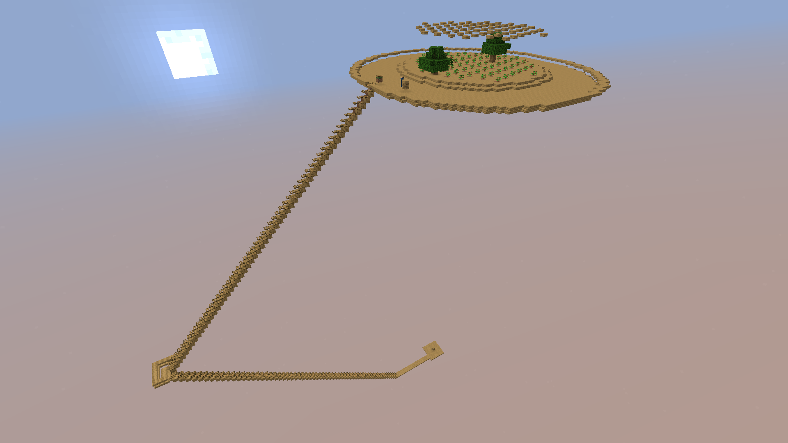

This blog will mainly be about my new skyblock world on jsorrell's [Carpet Sky Additions](https://modrinth.com/mod/carpet-sky-additions);
the one ilmango used in one of his [skyblock series](https://www.youtube.com/playlist?list=PLnC1rWWvOq51mTk75cMY8LENgR9FHWcyl),
and later in martincitopants' viral [skyblock video](https://www.youtube.com/watch?v=j_OwK2OzO8E).

{/* truncate */}

For the starting version, there were a couple of factors I had considered:  
- 1.18\< for the height change in caves & cliffs
- ≤1.21.x around the time when I last played minecraft
- Possibly \<1.20.2 to stack permanent discounts
- I want to stick to the last minor version of any major version

The carpet sky supports 1.19.x≤, so I went with 1.19.4

For carpet sky, my starting routine is:  
1. Migrate to \<63y within 1 hour to avoid phantoms, but stay ≤24 blocks from the world spawn to avoid mobs spawning at the saplings on top of the dirt.  
  Usually, this means a platform just below the starting island, which also acts as a safety net to catch the dirt blocks when tearing down the island.  

2. Get down to -64y, and spare a few dirt blocks to spread grass down along the staircase.  
  The trapdoor already prevents mobs from spawning along the staircase, and they still allow grass to spread underneath.  

3. Pathfinding-based general mob farm

Now, as I went down, I also found out that it's deep dark (seed [4171477899653627797](https://www.chunkbase.com/apps/seed-map#seed=4171477899653627797&platform=java_1_19_3&dimension=overworld&x=0&z=0&zoom=0.5)). Normally, I'd migrate everything near \<63y down to the new home at -64y and keep the tree farm dirt within 24 blocks of where I'll mainly hang out to still prevent mobs from spawning and put the mob farm at least 128 blocks away. But it's safe this time, so I'll put them closer :)

Next, I want to iterate on my previous mob farm [design](https://www.youtube.com/watch?v=D18STOgRdaA) a bit (my old account), which was originally based on ilmango's and gnembon's ideas.
