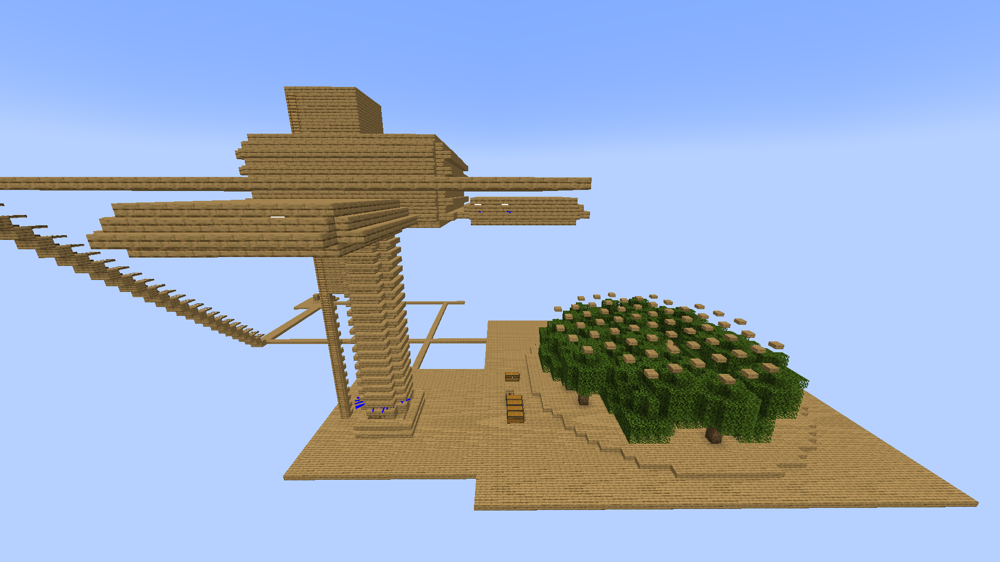
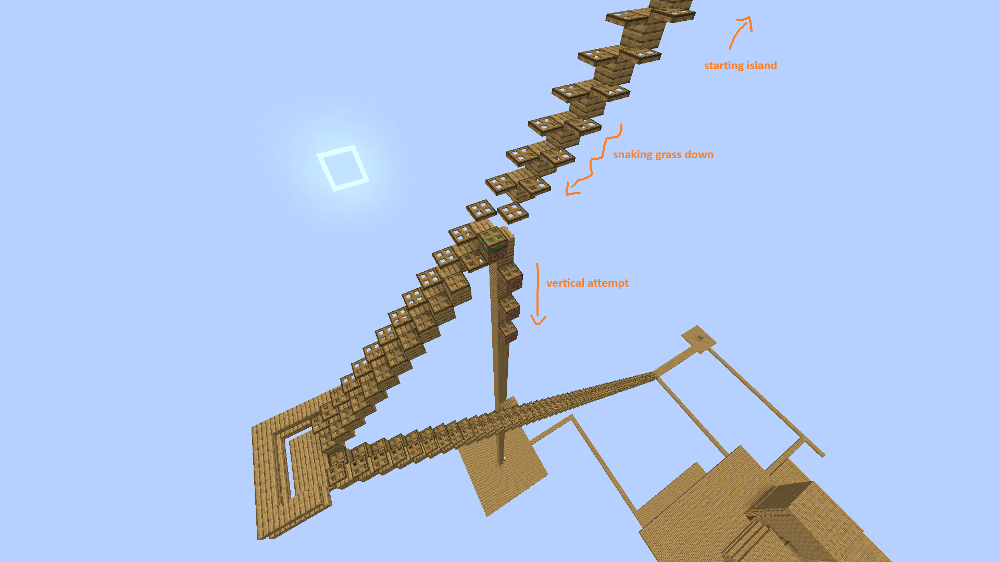
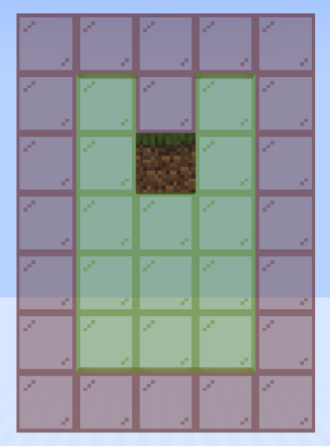
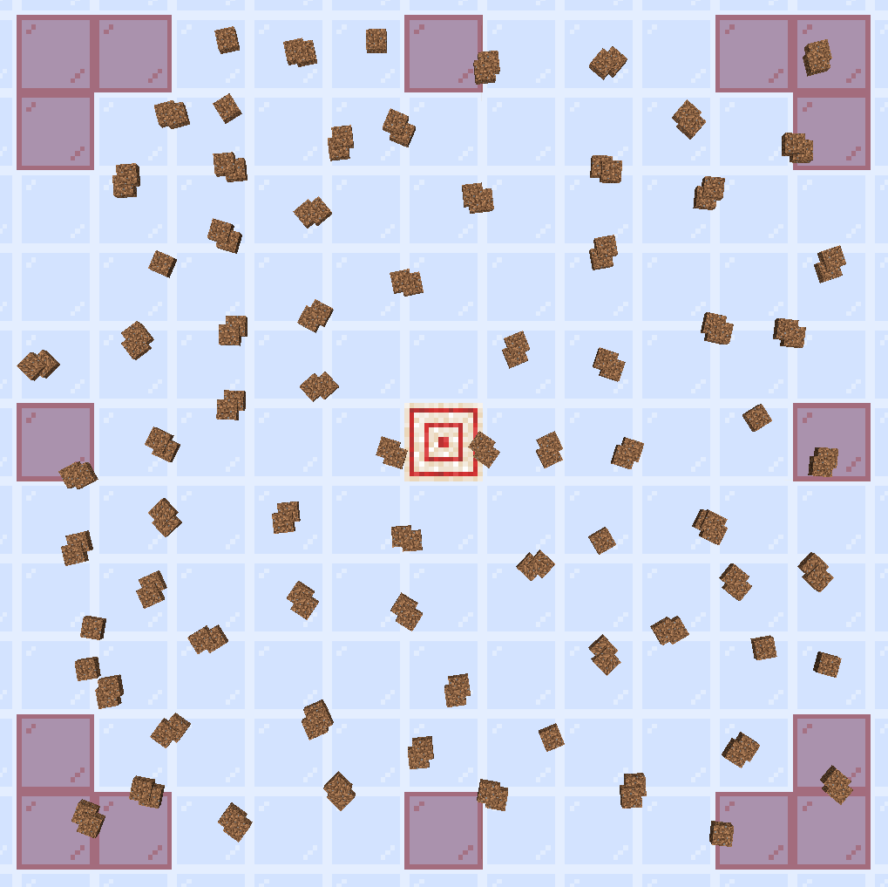
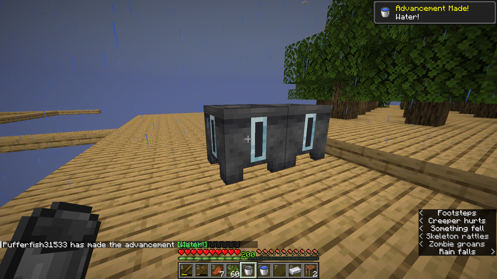

Migrated to -64y and built a pathfinding mob farm :)

{/* truncate */}

I've made a few changes to this version:

* Removed all redstone conductor at each spawning levels.  
  This is mainly just the oak planks at the main tower used for pathfinding, there are still a lot of solid blocks for them to pathfind to in the rest of the tower, although I haven't specifically calculated the odds from each possible spawning positions.  
* Added bat chambers.  
  I have 2 of them on either side of the 1st spawning floor here because any lower would be mostly deep dark. But ideally, they should be at -64y.  
  I still get bats from time to time, but eventually, all of them should be in the bat chamber if we use the farm for a while.  
* Reduced from 3 floors to 2.  
  I couldn't prevent the 3rd floor mobs from jumping after a few tries and most of them would die from the fall damage that way, which should be fine if we just want the basic loot, but the main point of this is to get iron ingots.  

I expect to make a few changes here and there to see how this iteration will go when I get to drowned, then I'll probably put the schematic in the [notes](/notes/skyblock/lets-play) section.

Also lost 2, maybe 3 dirt blocks as I snake them down the staircase to get the grass down T-T

I still don't want to use endermen for this, so I'm trying it vertically instead since we've already reached the bottom, and we should be able to go down 3 blocks at a time this way as well.

With vertical, we can also just have a platform to catch them safely when breaking as well. So I tested how far they could go by repeatedly breaking a block at build height and mark down their range at -64y:

I don't expect them to spread as far when broken from \<63y and falling to -64y, but I made sure the platform is at least 11x11 anyway for peace of mind.

Also got my first water in the meantime, so I'll try to get a few lightning rods next to fire-proof everything and then get a fishing pond going :)  
I might switch to the endermen method to move the grass if it becomes a bottleneck, especially since I'll have to move it horizontally to a pig-spawning biome anyway.

