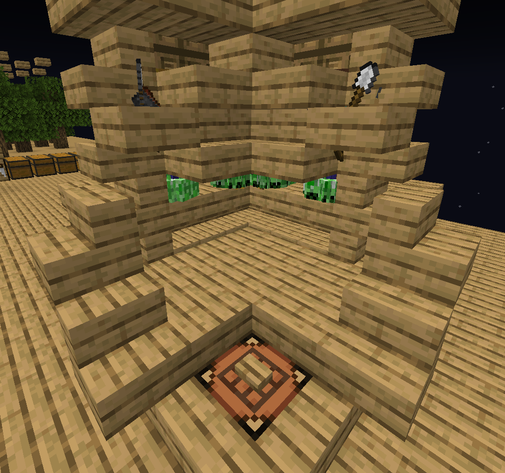
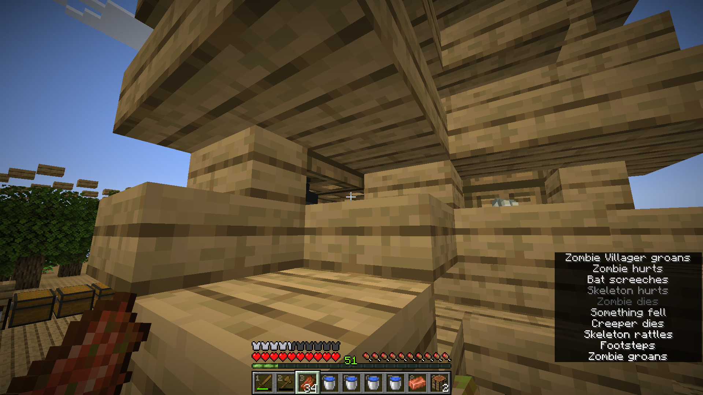
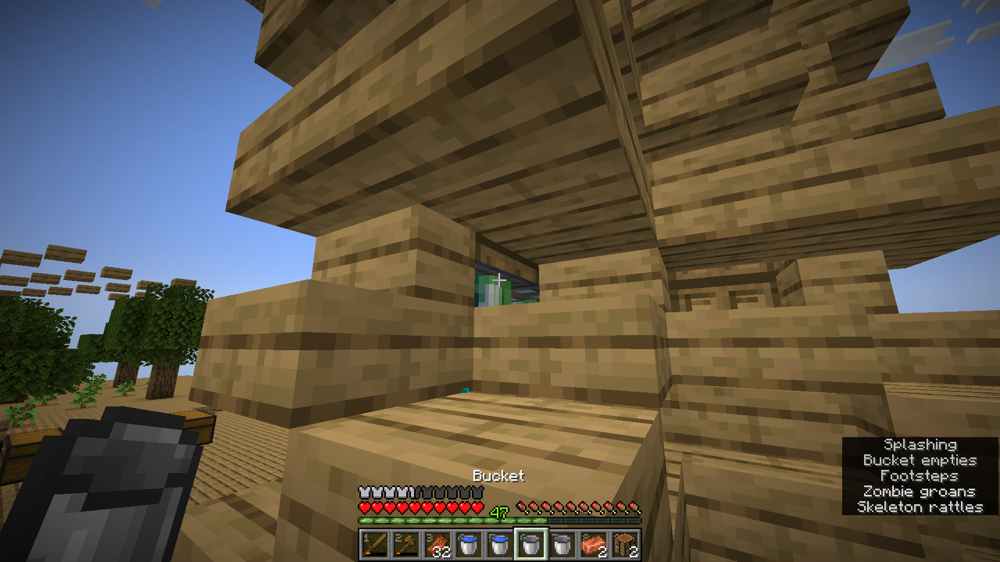
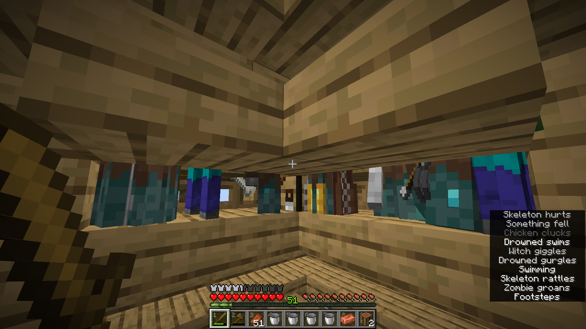
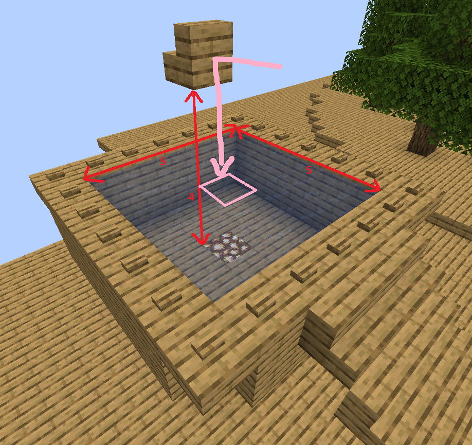
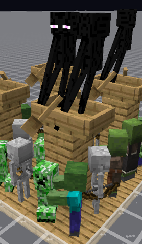
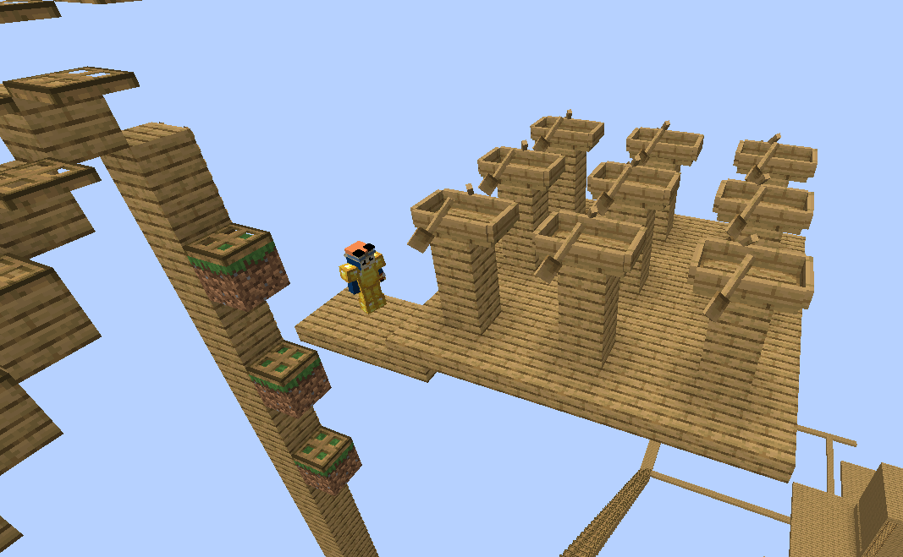

import Tabs from '@theme/Tabs';
import TabItem from '@theme/TabItem';

Last time we ended with a bucket of water, now we'll get drowned to lightning-proof everything, set up a fishing area, and probably just use enderman to get grass down.

{/* truncate */}

## Drowned Conversion

I had to indeed modify the killing area a bit so that I could more easily get drowned.  
The idea is to have a gap slightly above the mobs' heads where I can flip the trapdoors up,
which will keep the subsequent mobs on them and also waterlogged to drown the current set of mobs below it.  
It will kill off some mobs by drowning, but that's fine since this procedure is mainly just for drowned anyway, and any mobs that can swim will be stuck below the trapdoor.  

<Tabs>
    <TabItem value="trapdoor" label="1. Closing the trapdoors" default>
        
    </TabItem>
    <TabItem value="waterlogging" label="2. Waterlogging">
        
    </TabItem>
    <TabItem value="drowned" label="3. Drowned">
        
    </TabItem>
</Tabs>

Once the drowned is eliminated, we can remove the water and flip the trapdoors back open to let the next set of mobs in and repeat, or continue using the farm in normal mode.  

The trapdoor buffer also acts as a way to isolate mobs at the bottom where we can kill the unwanted ones off and get witch and zombie villagers out.

## Fishing

For fishing, we have a 5x4x5 area for treasure where the bottom 2 layers must be water sources or waterlogged blocks with no collisions and the top 2 layers must be air or lily pad.  

If the bobber doesn't land in the middle, the 5x4x5 centred around it will overlap with the oak plank and other stuff so we won't get treasure.
This isn't a problem in wide-open area where we can be imprecise with where we cast the bobber and still satisfy the open-water conditions, but we can also cast it against a designated block and have it land on the same block every time.
In this case, we can put the target block on the 3rd block above the water and 1 block behind the middle of the 5x5 so the bobber follows the pink trajectory in this image:

The block column above the bobber itself is still left open so we can still have rain on it.  

Now after building the setup, I totally forgot that I still need the first few fishing rods to jump start the loot until we get to a mending one T-T
So I'll try to get some sort of spider farm/setup for that soon.

The spider farm I had on my last skyblock was just a long enclosed platform going in squares of side length 24 so that when I'm on one side, the opposite side is just far enough to spawn, and we can keep walking around and around to manually kill them.
But I want to try to build one where I don't have to walk this time and just stand in the same spot and hit, probably attracting them by pathfinding or aggro, but that's for the next post at the very least.
Getting to villager is a more important progression line, so I'll focus more on that and just do the spider/fishing whenever I'm bored XD

## Enderman Grass

We still need grass block for pigs, and I'm sooooo bad at getting off ladders and already fell 2-3 times T-T
I think this was partly why I always wanted to just go down a staircase instead, but it's just too slow to spread grass without using a lot of dirt, and going down vertically is just too dangerous and frustrating for me.
Plus we have to spread it horizontally out of the deep dark anyway.

We can filter out enderman using boats placed high enough to not pick up any other shorter mobs, e.g. 2 blocks + 1 slab:

For safety, I'll leave it open so it'll only get spawns at night, then once we have an enderman, we can wait until all the other mobs despawn and approach safely during the day:

The hope is that we can catch some random spawns passively as we kill off mobs at the farm during nighttime.
The rates is a lot slower, so if it becomes slow and we really want to get going with pigs, then we'll just bridge out 128 blocks from it and walk in and out of range to quickly cycle through mobs.
