import Tabs from '@theme/Tabs';
import TabItem from '@theme/TabItem';

Mostly a design & planning chapter where we iterate on the mob farm kill chamber, prepare a spider setup to get the first few strings, and look into lightning protection.

{/* truncate */}

## Mob Farm Kill Chamber

I needed yet another fix to the farm kill chamber in that if I press against the block they are standing on, I'd still get hit.  
In this new version, I'm low enough that I won't get hit, and high enough that when in a corner, creepers pushed against the opposite corner still won't see me and explode.
Baby zombies can still see me this low, but their attack can't reach.
* Without the trapdoors, I'd be too low such that when standing near a corner, creepers in the opposite corner can see.
* If the trapdoors were bottom slabs, I'd be high enough that I'd get hit.
* Still fine crouched or uncrouched.
* But we probably need to revisit the kill chamber again on versions that affected mob reach.

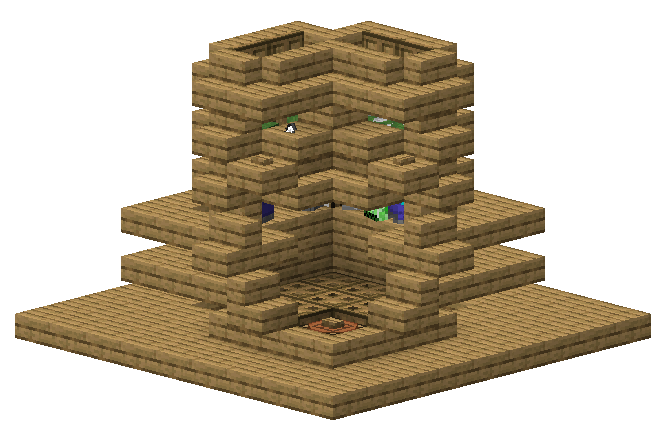

As for the drowning process, I've blocked off the top of the steps leading up to the trapdoor so that we don't get too close for creepers in the opposite corner to see.
But when we put the water in, they will float up to the trapdoor and see us anyway.
I don't have an easy wood-only solution for this yet except to climb down quickly after waterlogging the trapdoors;
they will start the hissing sound if our angles are unfortunate, but won't explode as long as we break the line of sight quick enough.
Luckily I haven't run into actual explosions yet.

There's still the issue of chicken jockey.
I've had 1 loose case that I almost died from T-T But that was before I went through the various adjustments, so I'll keep monitoring for them/not be too absent-minded when swiping away at the mobs and watching other stuff on youtube.
I suspect it's from me not voiding fully around the corners and an unfortunate knock back from the sweep attack pushing them there or something.

I tested with commands to summon a chicken jockey into each drop chute before, but not with the latest iteration where I just tested for not getting attacked and not being in line of sight with creepers. So I'll try summoning 8 of them with the chickens at 1hp at each of the corners to specifically test for the edge cases and see if we need to wrap the void chute around or something.

## Spiders

Looked into spiders a bit and the aggro range is just their follow range (16 ± random spawn bonus) so we can't spawn them already within range.
Another option is to have them aggro on iron golems instead, so we can be much more flexible in positioning relative to the player, but that will have to be after we get villagers/pumpkins.

I tried to test a simple pathfinding setup, and we can also just have them fall to their death instead of funnelling them into a player-kill chamber:

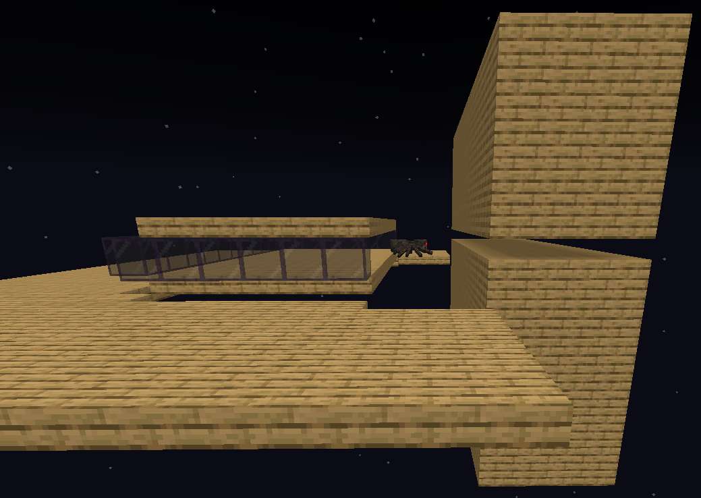

But if I were to take this approach, I'd want to do a bit more work on:
* enclosing the light without the walls being close enough for them to climb  
    (leave a small padding?),
* balancing platform size and number of layers against the solid block volume, and
* making the drop zone/item collection safe from skeletons from spider jockeys

That all seems a bit too much for just a few strings. But I also just realised we need them for villagers' bed as well. So I think I'll dig up my old world and just use the manual one I had before.

That design was just 4 thin spawning platforms in a square with side length > 24 so that when we're killing the spiders on one side, more can spawn on the other side.
The idea is that we can just keep killing spiders while going around in a loop:

<Tabs>
    <TabItem value="corridor" label="Corridor" default>
        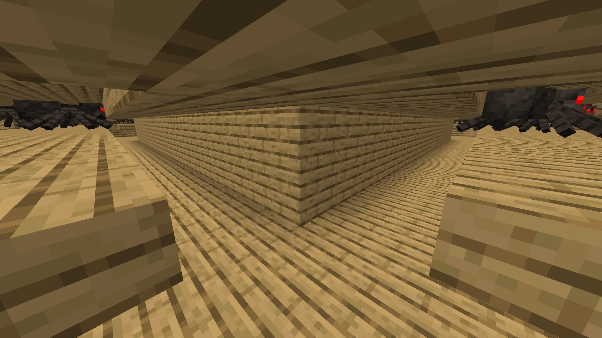
    </TabItem>
    <TabItem value="overview" label="Overview">
        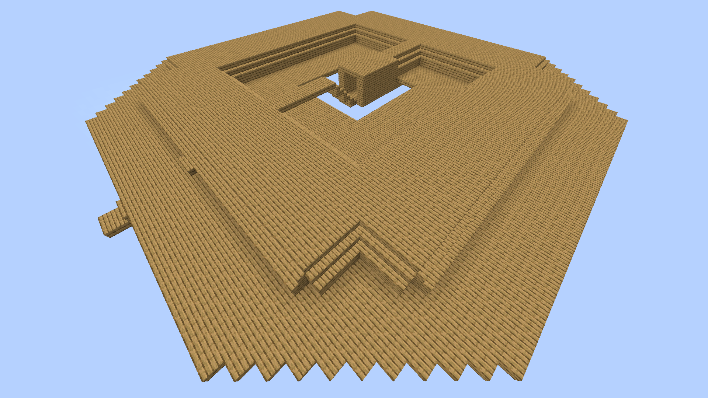
    </TabItem>
    <TabItem value="24-range" label="24 Range">
        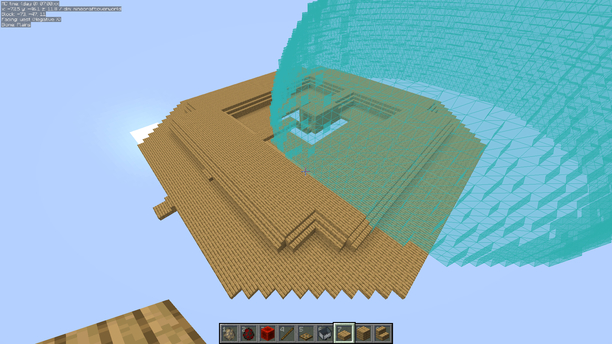
    </TabItem>
</Tabs>

The farm is still very bad, but we only need a few strings anyway.

At this point, I was going to finalise the next few steps with the spiders for fishing rods and beds, and then getting grass down and to a non-deep dark for pigs.
But then that got me thinking about the rest of the farm animals and I totally forgot about sheep where we can just shear them for wool as well T-T

We still need fishing to unlock bamboo, so we'll still get spiders. It just means I'll be getting enough strings just for a couple of rods for fishing, then just use wools for villager beds.

## Lightning

The next topic I wanted to look into was lightning protection. I expect at least some of these details to be different from the latest version at this point, especially with the changes to spawn chunks and random ticking chunks. So I just ran a few tests in **1.19.4** directly and will have to revisit these when I update.

### Range

First, in simulation distance (SD) 5 and render distance (RD) 2, the range of chunks they strike matches the range of entity-ticking chunks. In the example image, the player is in the white chunk, entity-ticking chunks in green, block-ticking chunks in orange, and border chunks in light blue:

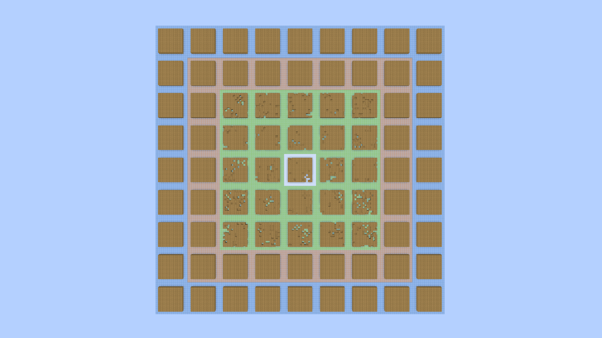

It is also further limited to chunks whose centre is \<128 blocks horizontally from a player.

I intend to stick to SD 12 and RD 12 on my main skyblock world, so I tested that as well. This is a wheat field where the growth naturally marks out random-ticking chunks, and the blank spots are where lightning struck, showing that the 2 ranges match:

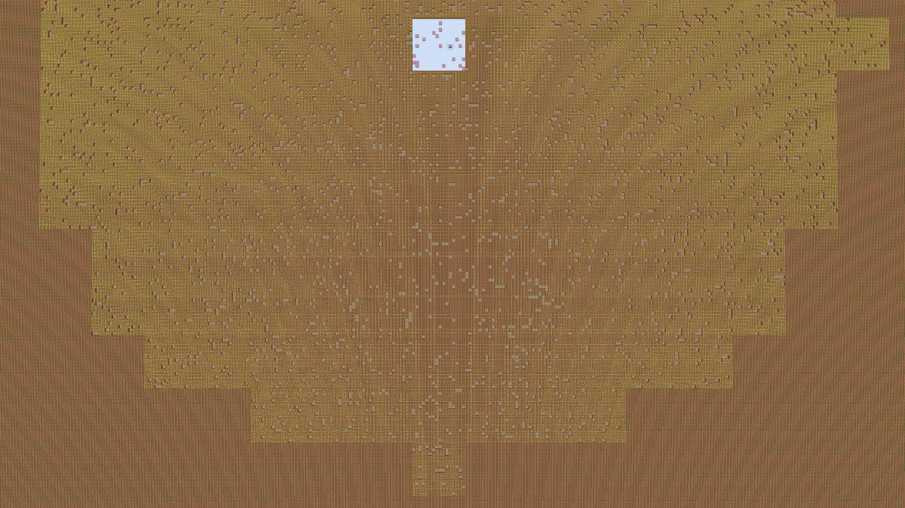

Lightning can still strike in chunks outside that range if it was *diverted* by a lightning rod. In this example, I have lightning rods in chunks of varying load levels, and since lightning will be diverted to the closest rod within range, they will go to the one on the left when I line them up like in the example, striking at the rod outside of lightning range:

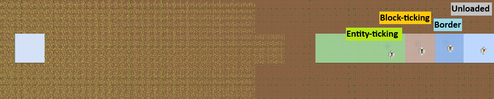

If the closest rod within range is in block-ticking or border chunks, it would divert there as well, but because those won't be ticking the lightning bolt entity itself, they'd hang in limbo until we get close enough to make them an entity-ticking chunk and get processed all at once:

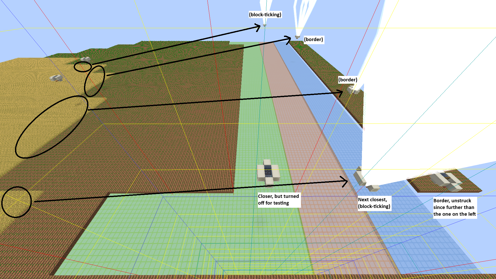

This is still fine because those chunks wouldn't get any lightning strike in the first place if there were no lightning rods there since they are only the ones that originated from the chunks within range and got diverted to them.

### Protection

Now the main question is whether our builds will be completely lightning-proof if they are entirely within 128 blocks from a lightning rod.

Unfortunately, this is insufficient in general because the lightning rod that covers a build can be outside loaded chunks. Consider a 7-chunk long build where we have a lightning rod in the middle. The build extends 3 chunks on either side of the chunk the rod is in, and well within 128 blocks of it. But in SD 5, RD 2, there is a 2-chunk wide gap between lightning chunks and unloaded chunks, meaning the player can be close enough to have part of the build be in lightning chunks, but far enough that the intended rod is not in loaded chunks:

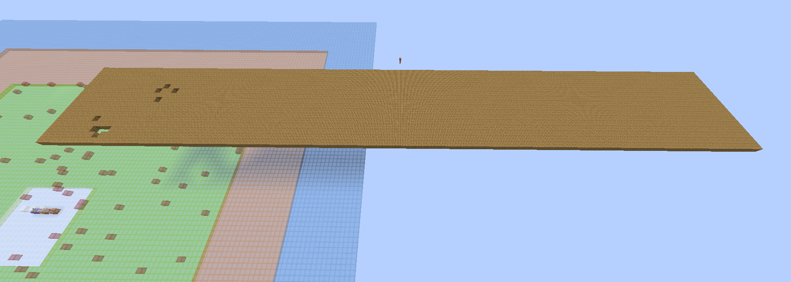

This gap is much larger for SD 12, RD 12 because the build would have to be at least 7 chunks from away from the rod. I.e. the builds should be fully contained within 6 chunks chebyshev (13x13) of a lightning rod.

For our purposes, the term "build" here just refers to anything we placed because we're in skyblock, including the usual meaning of "builds", but also the platforms, narrow walkways connecting them, etc. So we want to lightning-proof a potentially large area.

Covering an arbitrary area with minimal amount of circles is an open problem, arranging them in a slightly-overlapping hexagonal pattern is a good compromise. But I want to have them aligned in a grid instead, accepting even more overlaps, just so they are lined up nicely and easy to track by hand.  
For a circle of radius 128, the largest inscribed square would have $128\sqrt{2} \approx 181$ side length, so $\left\lfloor{181/16}\right\rfloor = 11$ chunks:

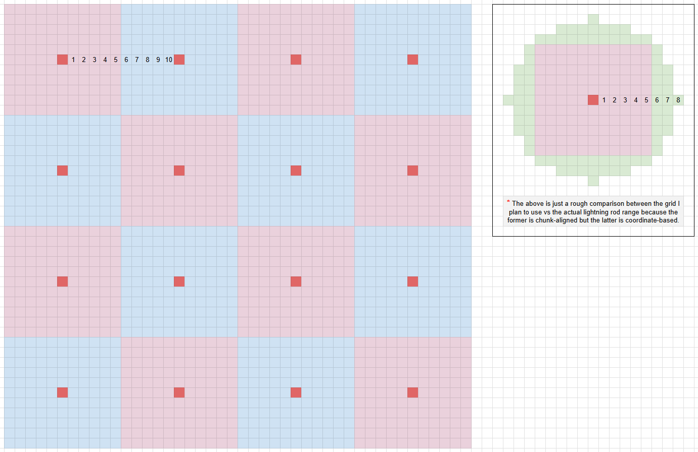

Builds will be within 5 chunks of a rod, so it can't be in lightning chunk without also loading the rod with SD 12, RD 12.
