import Tabs from '@theme/Tabs';
import TabItem from '@theme/TabItem';

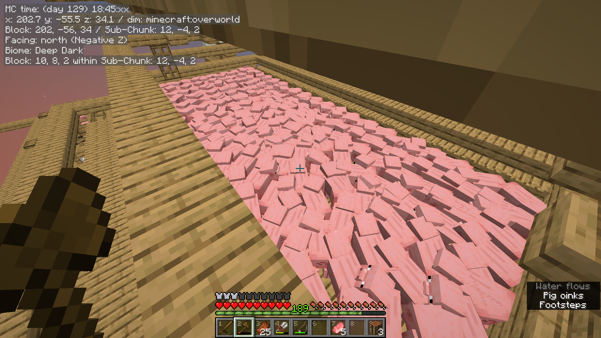

In this episode, we finally got our grass down and start breeding pigs, with spiders and fishing on the side :)

{/* truncate */}

## Grass

Finally got our enderman, but the grass block had to glitch wildly in the boat and shoot out into the void T-T

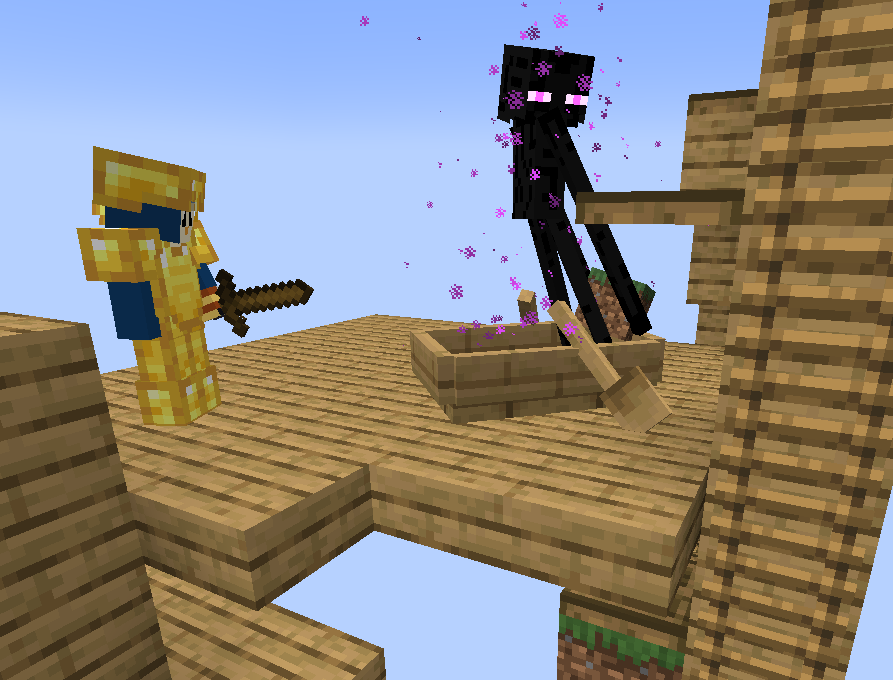

Luckily, I still had 2 more right below that from when I was still spreading it down vertically, so I'll get the temporary spawning setup going and try again. I also still have 1 last backup grass at the original island, so we're still fine in the worst case.  
But I want to be a lot more careful with dirt from now T-T

After a couple of nights cycling through the mobs again, we got another enderman, and we surrounded him this time XD

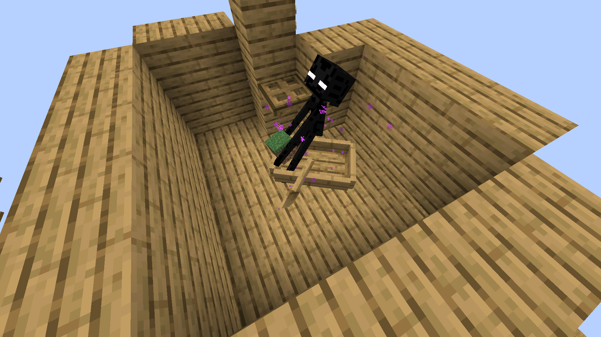

## Pig

For gold, I want a large/tileable pig breeding area so we can take advantage of the exponential growth, and have a way to funnel them into a 1x1 holding area with a ladder to disable their collision.

So I'm testing out something like this where we can flush about half of them to a holding area and continue breeding, or flush everyone:

<Tabs>
    <TabItem value="breeding-mode" label="Breeding Mode" default>
        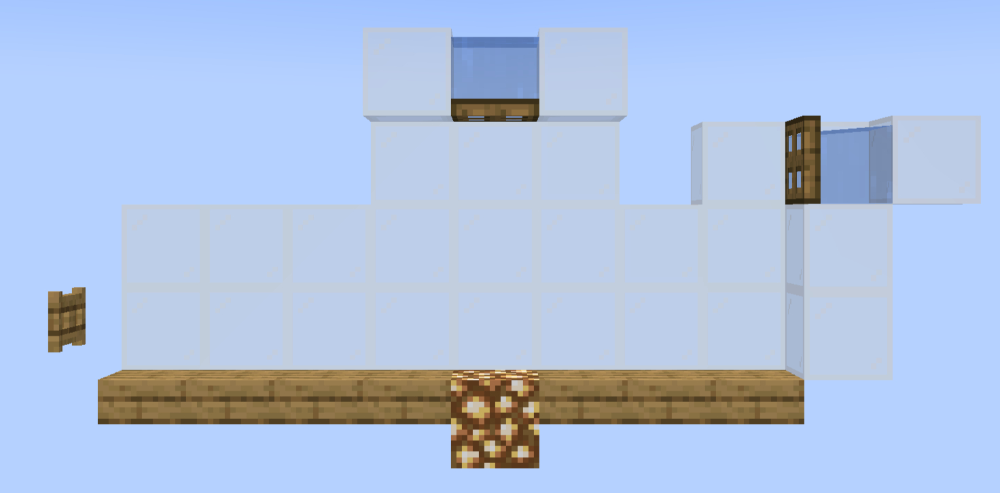
    </TabItem>
    <TabItem value="flush-mode-half" label="Flushing Mode (Half)">
        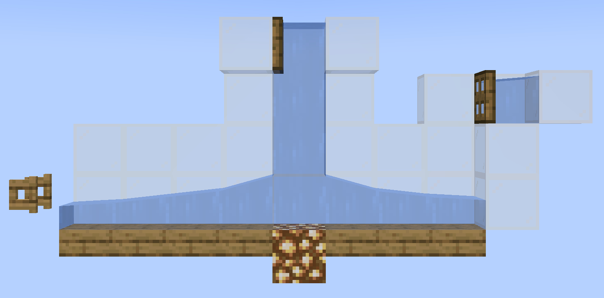
    </TabItem>
    <TabItem value="flush-mode-full" label="Flushing Mode (Full)">
        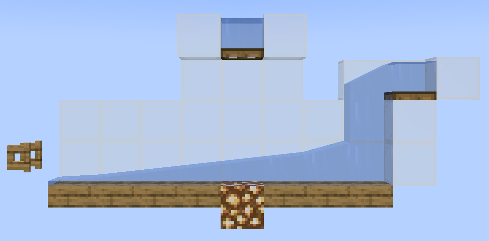
    </TabItem>
</Tabs>

The half-flush will have some pigs swim up the water column, so they can drown, but that's fine, and I can also just release the water briefly to circumvent that.
Although it'd be nice if we can come up with a different solution.

Last time I built a pig-lightning setup, I manually got a few leads first (spiders and slime) and tied up a few pigs to always have them in the breeding area and just flush everything else, which worked fine, but I wanted to try keeping more of the population this time with the half-flush mode.

I'll also move the water for the full-flush mode down to the feet level as well, so there won't be any drowning there. I moved it up thinking I'd put the trapdoors out of the way when we spam right-click to breed them, but I don't think it's necessary here since we can face away from that back wall anyway, and the pig will also be stuck in the breeding area unless we open the fence gate even if we accidentally open the trapdoor to let the water out.

Next, I tried putting it together with:
* 18x7 breeding area
* guard rails for the pigs, accounting for those that may swim up from the half-flush mode
* mini-platforms along the trapdoors and fence gates with guard rails on both ends so we can safely and mindlessly run sideways while flipping them all
* ladders to get in and out at various points

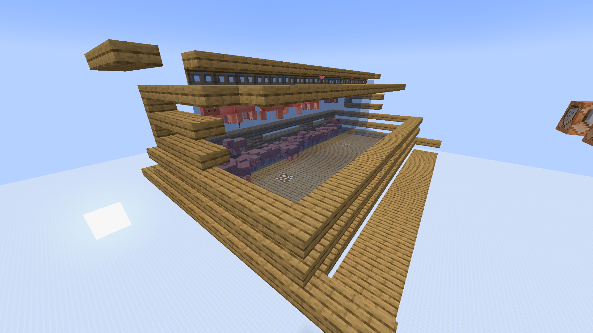

Waterlogged boat is used to transfer them from the water channel into a ladder-ed holding chamber to prevent entity cramming. After some testing we should also make sure that they won't clip into adjacent blocks to the side or above, otherwise their physics would shoot most of them out very wildly.  
I got to this setup to fit both the pig and the zombified piglin after they converted:

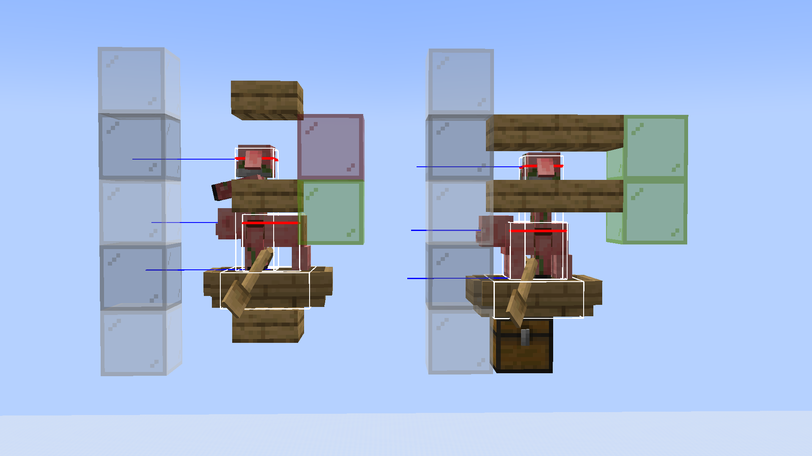

The lightning rod itself should also be high enough to not hit the boat, and low enough to hit the pigs.

After building it in survival and actually got to breeding with it, the flushing turns out to be vastly over-complicated as the platform to open/close the fence gate also doubles up as a way to lure them into the water channel and naturally leaving those that are out of range behind. So the half-flush mode is completely unnecessary XD  
I'd still need the full flush for when I'm clearing out the whole area.

But for now, I'll continue breeding them until we get to the next thunderstorm :)

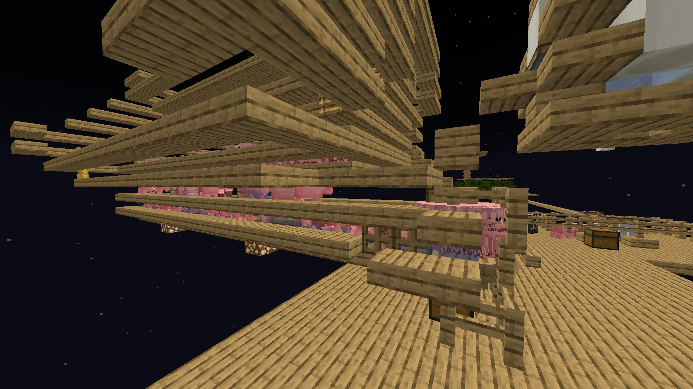

## Spiders

I decided to just use my previous design and just add in some minor optimisations like pack spawning skirts and removing solid blocks at the spawning levels.
Then about half-way through building, I totally forgot we're in deep dark T-T

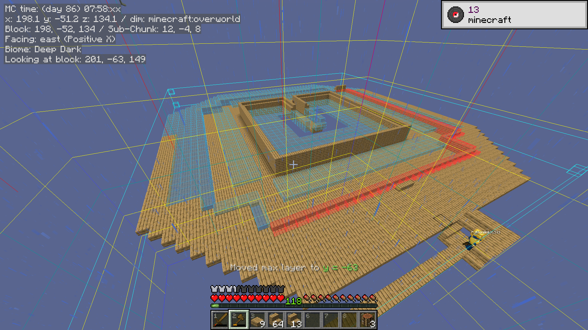

So this time, we make sure to check the biome first XD

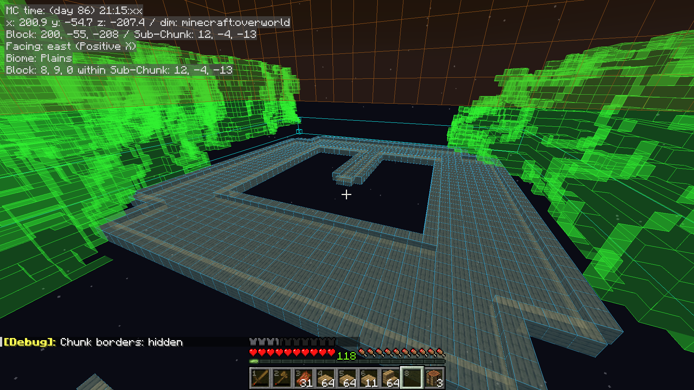

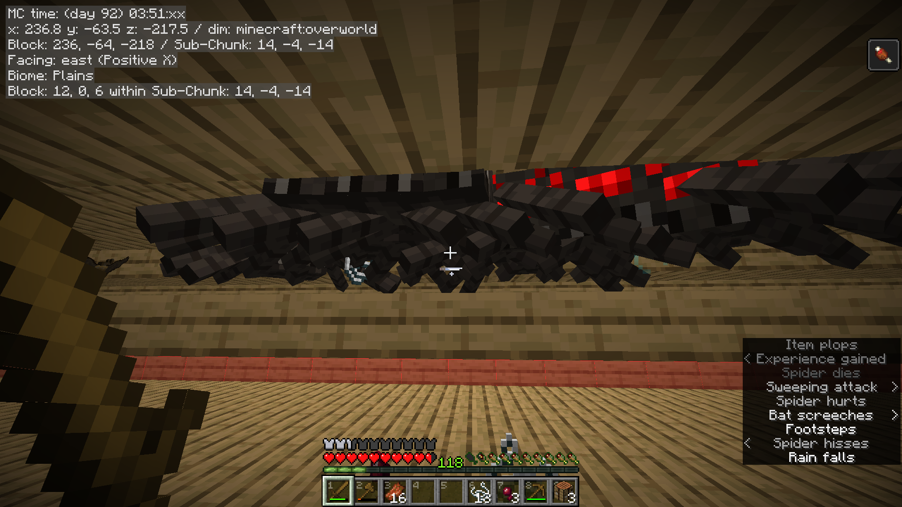

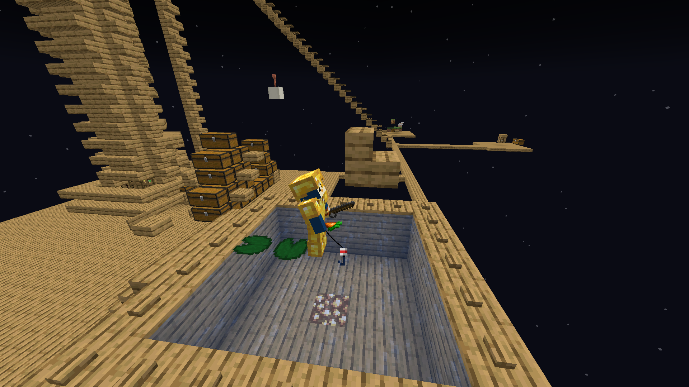

Now our current routine is:

1. Breed pigs when off cooldown, fully flushing them into the holding chamber at the next thunderstorm.
2. Shear sheep for wool for villager beds.
3. Continue with the mob grinder for general loot, focusing on building up a bank of copper for lightning rods.
4. Fish when it's raining just to make it a bit more tolerable T-T
5. Chop trees when mostly grown.

We got to about 700 pigs so far and a few stacks of wool to comfortably support a breeder and iron farm in the near future.

So our next step is preparing a witch and 2 zombie villagers while continuing the routine above :)
