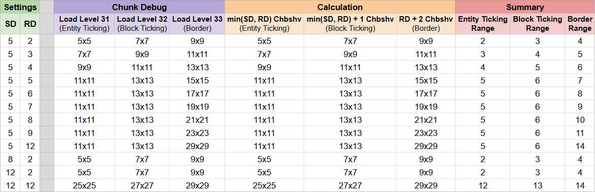

# Chunks

## Simulation and Render Distance

In this section, I use *range*, r, to mean the number of chunks less than or equal r Chebyshev distance from the chunk the player is in.  

* **Entity ticking range** is determined by **simulation distance**, but can be no greater than **render distance**.  
* **Block ticking range** is determined by **entity ticking range + 1**.  
* **Border range** is determined by **render distance + 2**.

    

        Examples as tested on singleplayer 26.2 with [ChunkDebug](https://modrinth.com/mod/chunk-debug)
    

    

